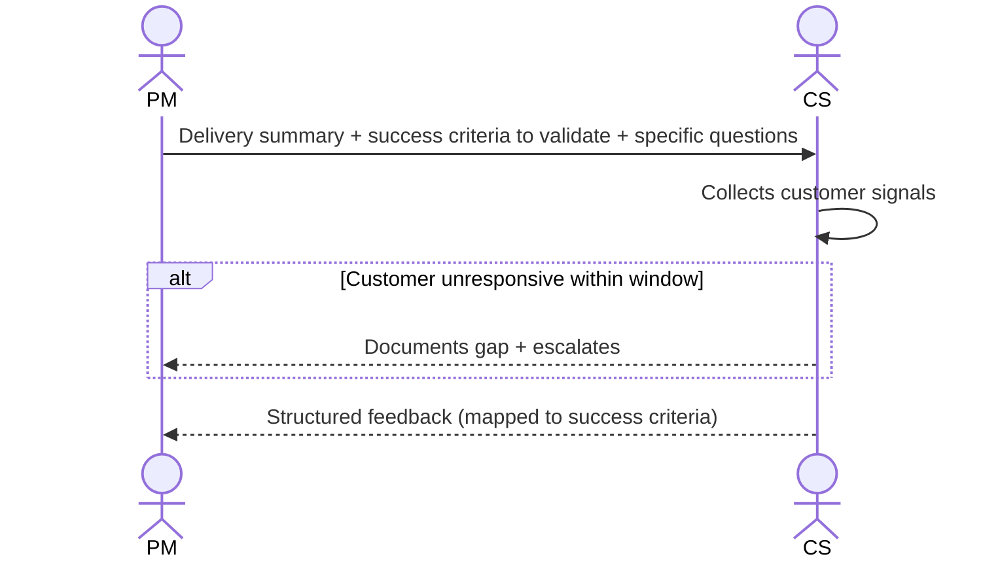

# Interaction 13 — PM → CS (Delivery Summary)

**Direction:** PM initiates. CS receives.
**Layer:** Post-Delivery

---

## Trigger

The release is complete. The PM initiates the feedback loop within 5 business days.

---

## What the PM Provides

- Summary of what was delivered and what was deferred
- Success criteria defined in the Readiness Package — for CS to validate against customer behavior
- Any known post-release limitations or monitoring points
- Specific questions for CS to collect from customers (adoption signal, friction, outcome confirmation)

---

## What CS Does With This

- Collects customer satisfaction and adoption signals
- Documents friction or unexpected behavior post-release
- Returns structured feedback to the PM and the PO within the agreed window

---

## Ownership Transfer

**From the PM:** Delivery facts and success criteria are transferred. The PM does not collect customer feedback directly — that channel belongs to CS.
**To CS:** Owns customer signal collection — adoption indicators, friction reports, and structured feedback mapped to the success criteria. CS is responsible for returning feedback within the agreed window.
**Artifact transferred:** Delivery summary + success criteria to validate + specific questions for customers.

---

## Gate

CS does not summarize feedback as "the customer is happy" or "the customer is not happy." Feedback must be structured against the success criteria defined in the package.

---

## Failure Path

If CS cannot collect meaningful signal within the agreed window (e.g., customer unresponsive), CS documents the gap and escalates to the PM. The loop is not left open silently.

---

## What CS Must NOT Do

- Promise the customer a follow-up feature or fix based on feedback without PO triage
- Submit unstructured feedback ("generally positive")
- Leave the feedback window open indefinitely without escalating

---

## Sequence

