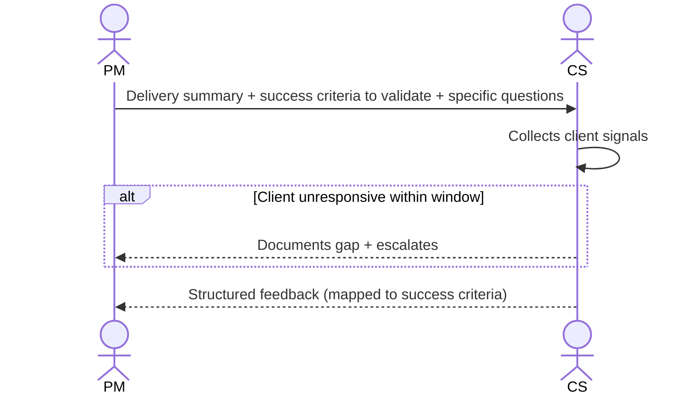

# Interaction 13 — PM → CS (Delivery Summary)

**Direction:** PM initiates. CS receives.
**Layer:** Post-Delivery

---

## Trigger

Release has been completed. PM initiates the feedback loop within 5 business days.

---

## What PM Provides

- Summary of what was delivered and what was deferred
- Success criteria defined in the Readiness Package — for CS to validate against client behavior
- Any known post-release limitations or monitoring points
- Specific questions for CS to gather from clients (adoption signal, friction, outcome confirmation)

---

## What CS Does With It

- Collects client satisfaction and adoption signals
- Documents friction or unexpected behavior post-release
- Returns structured feedback to PM and PO within the agreed window

---

## Ownership Transferred

**From PM:** Delivery facts and success criteria are handed over. PM does not collect client feedback directly — that channel belongs to CS.
**To CS:** Owns client signal collection — adoption indicators, friction reports, and structured feedback mapped to the success criteria. CS is accountable for returning the feedback within the agreed window.
**Artifact handed over:** Delivery summary + success criteria to validate + specific questions for clients.

---

## Gate

CS does not summarize the feedback as "client is happy" or "client is not happy." The feedback must be structured against the success criteria defined in the package.

---

## Failure Path

If CS cannot collect meaningful signal within the agreed window (e.g., client is unresponsive), CS documents the gap and escalates to PM. The loop is not silently left open.

---

## What CS Must NOT Do

- Promise the client a follow-up feature or fix based on their feedback without PO triage
- Submit unstructured feedback ("generally positive")
- Leave the feedback window open indefinitely without escalating

---

## Sequence

