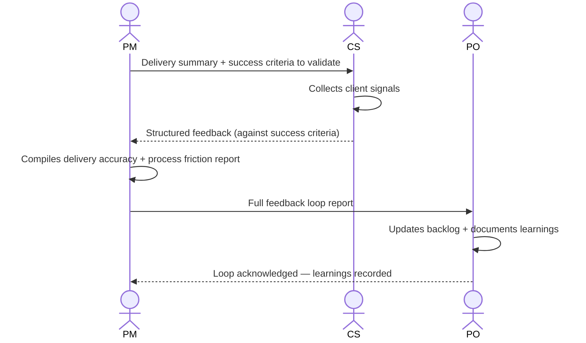

# Interaction 14 — PM → PO (Feedback Loop Close)

**Direction:** PM initiates. PO receives.
**Layer:** Post-Delivery

---

## Trigger

Feedback has been collected from CS and internal delivery metrics are available.

---

## What PM Provides

- Delivery accuracy report: milestones met, scope changes, estimation accuracy
- Process friction points: where the model slowed down or broke
- CS feedback summary: client outcome vs. success criteria

---

## What PO Does With It

- Updates product vision and backlog based on outcomes
- Documents learnings that affect future triage decisions
- Identifies any new demands surfaced by the delivery
- Feeds insights back into the opportunity backlog for the next cycle

---

## Ownership Transferred

**From PM:** Delivery metrics and CS feedback are compiled and handed over. PM's accountability for this demand cycle ends when PO acknowledges and closes the loop.
**To PO:** Owns the learning integration — backlog updates, documented lessons, and any new demands surfaced by the delivery. The loop is not closed until PO has recorded the learnings, not merely received the report.
**Artifact handed over:** Delivery accuracy report + process friction points + CS feedback summary.

---

## Gate

The feedback loop is not closed until the PO has acknowledged the findings and documented the learnings. An unacknowledged feedback delivery is an open loop.

---

## Failure Path

If PO does not acknowledge within the expected window, PM escalates. Open feedback loops that span multiple delivery cycles degrade the quality of future triage decisions.

---

## What PO Must NOT Do

- Acknowledge receipt without documenting the learnings
- Dismiss process friction points without noting them for review
- Leave the loop open by not responding to the PM's report

---

## Sequence

