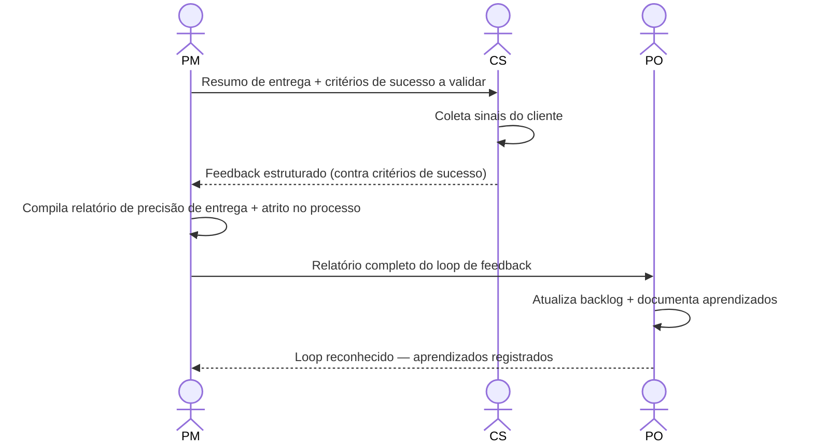

# Interação 14 — PM → PO (Fechamento do Loop de Feedback)

**Direção:** PM inicia. PO recebe.
**Camada:** Pós-Entrega

> Esta interação **instancia a camada 3 de [`../metrics.md`](../metrics.md)** (resultado de negócio: projetado vs. realizado). O delta entre os Critérios de Sucesso *projetados* no intake/RP — que carregam confiança — e o resultado *medido* calibra a confiança de futuras projeções da Submitter. Com o tempo, o acerto de projeção vira uma métrica de qualidade da própria persona, análoga ao "aceite na 1ª versão".

---

## Gatilho

O feedback foi coletado do CS e as métricas de entrega internas estão disponíveis.

---

## O que o PM Fornece

- Relatório de precisão de entrega: marcos cumpridos, mudanças de escopo, precisão de estimativas
- Pontos de atrito no processo: onde o modelo desacelerou ou quebrou
- Resumo do feedback do CS: resultado do cliente vs. critérios de sucesso

---

## O que o PO Faz Com Isso

- Atualiza a visão de produto e o backlog com base nos resultados
- Documenta aprendizados que afetam futuras decisões de triagem
- Identifica quaisquer novas demandas surgidas pela entrega
- Retroalimenta insights para o opportunity backlog para o próximo ciclo

---

## Transferência de Ownership

**Do PM:** Métricas de entrega e feedback do CS são compilados e transferidos. A responsabilidade do PM para este ciclo de demanda termina quando o PO reconhece e fecha o loop.
**Para o PO:** Detém a integração de aprendizados — atualizações de backlog, lições documentadas e quaisquer novas demandas surgidas pela entrega. O loop não está fechado até que o PO tenha registrado os aprendizados, não apenas recebido o relatório.
**Artefato transferido:** Relatório de precisão de entrega + pontos de atrito no processo + resumo de feedback do CS.

---

## Gate

O loop de feedback não está fechado até que o PO tenha reconhecido os findings e documentado os aprendizados. Uma entrega de feedback não reconhecida é um loop aberto.

---

## Caminho de Falha

Se o PO não reconhecer dentro da janela esperada, o PM escala. Loops de feedback abertos que abrangem múltiplos ciclos de entrega degradam a qualidade das futuras decisões de triagem.

---

## O que o PO NÃO Deve Fazer

- Reconhecer o recebimento sem documentar os aprendizados
- Descartar pontos de atrito no processo sem anotá-los para revisão
- Deixar o loop aberto sem responder ao relatório do PM

---

## Sequência

