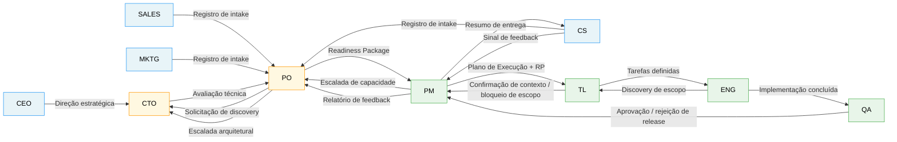

# Índice de Interações

Cada arquivo nesta pasta documenta uma interação bilateral entre dois papéis.

## Mapa de Interações

## Índice de Arquivos

| # | Arquivo | Interação | Camada |
|---|---|---|---|
| 01 | `01-sales-to-po.md` | Vendas → PO | Upstream → Intake |
| 02 | `02-cs-to-po.md` | CS → PO | Upstream → Intake |
| 03 | `03-marketing-to-po.md` | Marketing → PO | Upstream → Intake |
| 04 | `04-ceo-to-cto.md` | CEO → CTO | Executivo → Liderança Técnica |
| 05 | `05-po-to-cto.md` | PO → CTO | Dentro do Intake |
| 06 | `06-cto-to-po.md` | CTO → PO | Dentro do Intake |
| 07 | `07-po-to-pm.md` | PO → PM | Intake → Downstream |
| 08 | `08-pm-to-po-capacity.md` | PM → PO (Escalada de Capacidade) | Dentro do Downstream |
| 09 | `09-pm-to-tech-leads.md` | PM → Tech Leads | Dentro do Downstream |
| 10 | `10-tech-leads-to-engineers.md` | Tech Leads → Engenheiros | Dentro do Downstream |
| 11 | `11-engineers-to-qa.md` | Engenheiros → QA | Dentro do Downstream |
| 12 | `12-qa-to-pm.md` | QA → PM | Dentro do Downstream |
| 13 | `13-pm-to-cs.md` | PM → CS | Pós-Entrega |
| 14 | `14-pm-to-po-feedback.md` | PM → PO (Fechamento do Loop de Feedback) | Pós-Entrega |

## Resumo das Regras de Rejeição

| Interação | Pode ser rejeitada? | Responsável pela rejeição |
|---|---|---|
| Vendas → PO | Sim — intake incompleto | PO devolve para Vendas |
| CS → PO | Sim — evidência insuficiente | PO abre Discovery |
| Marketing → PO | Sim — não é padrão de segmento | PO redireciona para CS/Vendas |
| CEO → CTO | Não — mas gera trade-off | CTO apresenta o custo ao CEO |
| PO → CTO | Sim — escopo inviável | CTO devolve com veto + justificativa |
| CTO → PO | Não — PO deve integrar | PO escala discordância explicitamente |
| PO → PM | Sim — RP incompleto | PM devolve com gaps específicos |
| PM → PO (capacidade) | Não — dispara decisão | PO decide o trade-off |
| PM → Tech Leads | Sim — contexto faltando | TL devolve gaps específicos |
| Tech Leads → Engenheiros | Sim — tarefa indefinida | Eng devolve pergunta específica |
| Engenheiros → QA | Sim — no-go | QA devolve critérios com falha |
| QA → PM | Não — PM não pode sobrepor | PM escala apenas o prazo |
| PM → CS | Não — CS deve coletar | CS devolve feedback estruturado |
| PM → PO (feedback) | Não — PO deve reconhecer | PO fecha o loop explicitamente |

> **Nota sobre as três primeiras linhas (Submitter → PO).** Com o modelo maturado da persona Submitter ([`../personas/01-submitter.md`](../personas/01-submitter.md)), "intake incompleto" não é mais binário. A devolução só acontece quando um requisito **bloqueante** fica sem nenhuma disposição — não quando um campo tem baixa confiança. Um requisito atinge prontidão por qualquer disposição honesta (`answered · inferred · assumption · discovery · deferred`), então "ainda não sabemos" deixou de ser motivo de rejeição: vira premissa a validar ou rota de Discovery, e o registro avança com o Readiness Score refletindo o que ainda é frágil.
