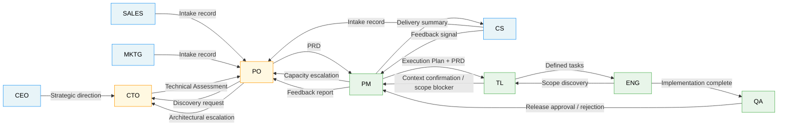

# Interactions Index

Each file in this folder documents a bilateral interaction between two roles.

## Interaction Map

## File Index

| # | File | Interaction | Layer |
|---|---|---|---|
| 01 | `01-sales-to-po.md` | Sales → PO | Upstream → Intake |
| 02 | `02-cs-to-po.md` | CS → PO | Upstream → Intake |
| 03 | `03-marketing-to-po.md` | Marketing → PO | Upstream → Intake |
| 04 | `04-ceo-to-cto.md` | CEO → CTO | Executive → Technical Leadership |
| 05 | `05-po-to-cto.md` | PO → CTO | Within Intake |
| 06 | `06-cto-to-po.md` | CTO → PO | Within Intake |
| 07 | `07-po-to-pm.md` | PO → PM | Intake → Downstream |
| 08 | `08-pm-to-po-capacity.md` | PM → PO (Capacity Escalation) | Within Downstream |
| 09 | `09-pm-to-tech-leads.md` | PM → Tech Leads | Within Downstream |
| 10 | `10-tech-leads-to-engineers.md` | Tech Leads → Engineers | Within Downstream |
| 11 | `11-engineers-to-qa.md` | Engineers → QA | Within Downstream |
| 12 | `12-qa-to-pm.md` | QA → PM | Within Downstream |
| 13 | `13-pm-to-cs.md` | PM → CS | Post-Delivery |
| 14 | `14-pm-to-po-feedback.md` | PM → PO (Feedback Loop Closure) | Post-Delivery |

## Rejection Rules Summary

| Interaction | Can be rejected? | Rejection owner |
|---|---|---|
| Sales → PO | Yes — incomplete intake | PO returns to Sales |
| CS → PO | Yes — insufficient evidence | PO opens Discovery |
| Marketing → PO | Yes — not a segment pattern | PO redirects to CS/Sales |
| CEO → CTO | No — but generates a trade-off | CTO presents the cost to CEO |
| PO → CTO | Yes — infeasible scope | CTO returns Technical Assessment with veto + rationale |
| CTO → PO | No — PO must reference and merge into PRD | PO escalates disagreement explicitly |
| PO → PM | Yes — incomplete PRD | PM returns with specific gaps (routed to PO or CTO) |
| PM → PO (capacity) | No — triggers a decision | PO decides the trade-off |
| PM → Tech Leads | Yes — missing context | TL returns specific gaps |
| Tech Leads → Engineers | Yes — undefined task | Engineer returns specific question |
| Engineers → QA | Yes — no-go | QA returns failing criteria |
| QA → PM | No — PM cannot override | PM escalates only the deadline |
| PM → CS | No — CS must collect | CS returns structured feedback |
| PM → PO (feedback) | No — PO must acknowledge | PO closes the loop explicitly |

> **Note on the first three rows (Submitter → PO).** With the matured Submitter persona model ([`../personas/01-submitter.md`](../personas/01-submitter.md)), "incomplete intake" is no longer binary. A return only happens when a **blocking** requirement has no disposition at all — not when a field has low confidence. A requirement reaches readiness through any honest disposition (`answered · inferred · assumption · discovery · deferred`), so "we don't know yet" is no longer a rejection reason: it becomes a premise to validate or a Discovery route, and the record advances with the Readiness Score reflecting what is still fragile.
