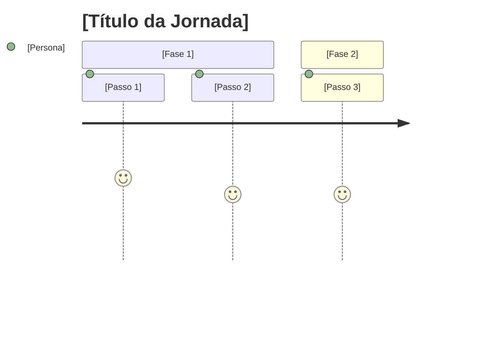
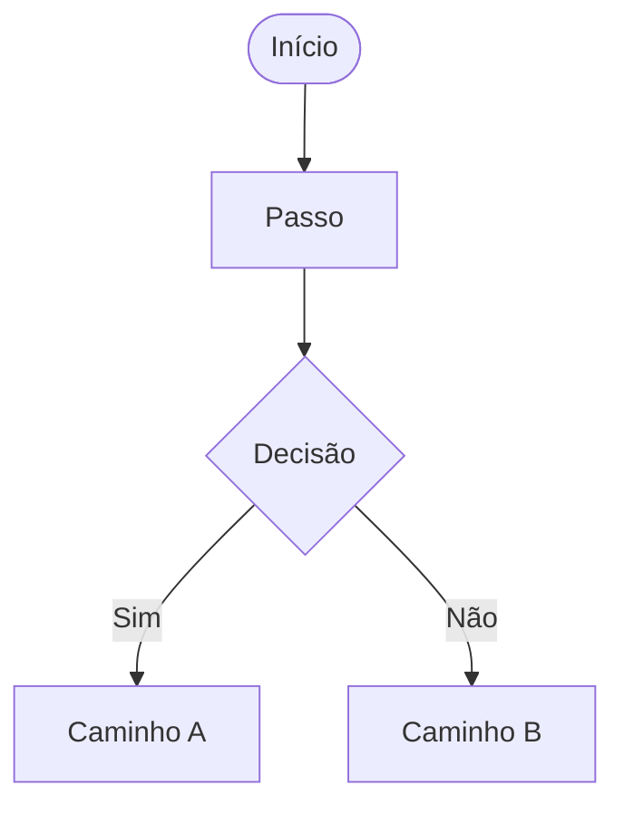

# Product Backlog — [Nome da Demanda]

## Metadados

| Campo | Valor |
|---|---|
| **ID do Backlog** | PB-AAAA-NNN |
| **Versão** | v1 |
| **RP vinculado** | RP-AAAA-NNN vX |
| **Responsável** | [Nome] (PO) |
| **Status** | Rascunho |
| **Data de baseline** | — |

> Este documento define **o que** será construído e **para quem**, da perspectiva do usuário.
> Não define como será construído. Decisões técnicas, tarefas e abordagem de implementação pertencem ao Tech Backlog (TB-AAAA-NNN).

## Histórico de Revisão

| Versão | Data | Autor | Resumo |
|---|---|---|---|
| v1 | AAAA-MM-DD | [Nome] (PO) | Backlog inicial. |

---

## Mapa de Épicos

| Épico | Descrição | Prioridade |
|---|---|---|
| EP-001 | [Nome do Épico] | Must Have / Should Have / Could Have |

---

## Jornada do Usuário

### Jornada Geral — [Persona Principal]

> Comece com uma `journey` de alto nível cobrindo a experiência end-to-end. Cada épico pode adicionar seu próprio diagrama (flowchart, sequenceDiagram, etc.) na sua seção quando isso ajudar a clarificar o fluxo. Não force diagramas em todo épico — use apenas onde aumentam compreensão.

---

### EP-001 — Jornada de [Nome do Épico]

> Opcional. Use um diagrama por épico apenas quando o fluxo merece visualização. Tipos comuns:
> - `flowchart` — decisões e ramificações
> - `sequenceDiagram` — interações entre atores e sistema
> - `journey` — experiência narrativa de uma persona

---

## EP-001 — [Nome do Épico]

**Objetivo:** [Objetivo do épico em uma frase, ancorado em valor para o usuário]

---

### ST-001 — [Nome da História]

**Como** [persona],
**quero** [ação],
**para que** [benefício].

**Critérios de Aceite:**
- [ ] [Critério 1]
- [ ] [Critério 2]

**Edge Cases:**
- [ ] [Edge case 1]
- [ ] [Edge case 2]

---

## Fora do Escopo (neste release)

Os itens a seguir foram explicitamente excluídos e não devem ser introduzidos durante a entrega. Qualquer adição requer um novo registro de intake.

| Item | Motivo |
|---|---|
| [Item 1] | [Motivo] |
