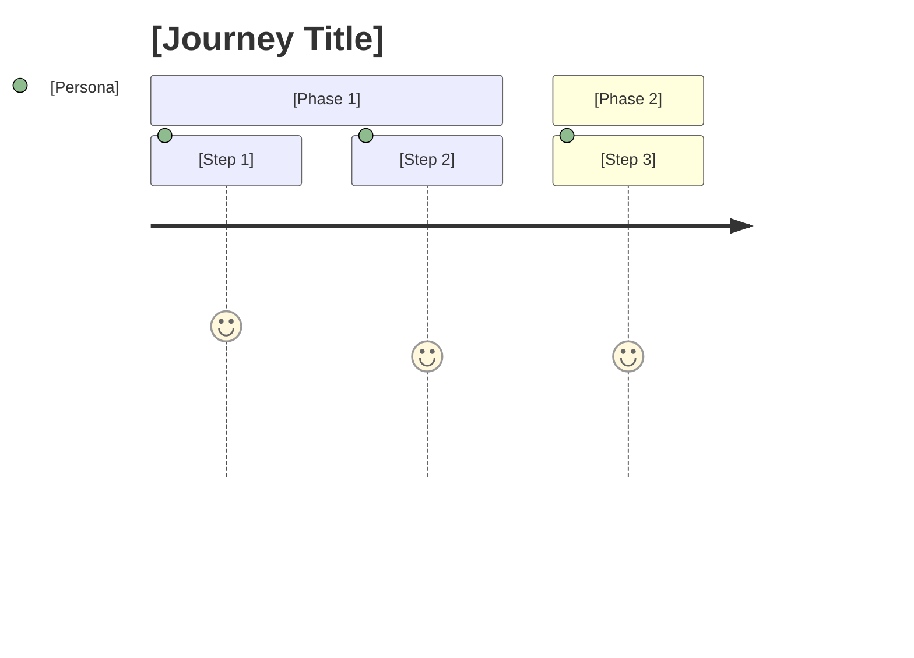
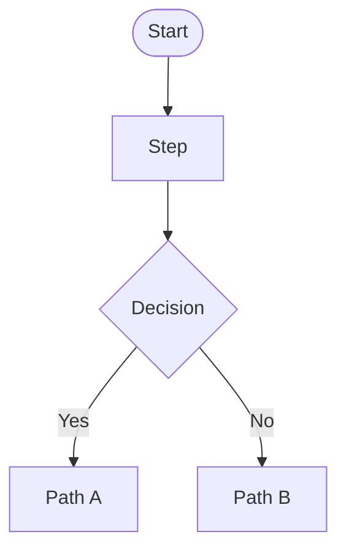

# Product Backlog — [Demand Name]

## Metadata

| Field | Value |
|---|---|
| **Backlog ID** | PB-YYYY-NNN |
| **Version** | v1 |
| **Linked RP** | RP-YYYY-NNN vX |
| **Owner** | [Name] (PO) |
| **Status** | Draft |
| **Baseline date** | — |

> This document defines **what** will be built and **for whom**, from the user's perspective.
> It does not define how it will be built. Technical decisions, tasks, and implementation approach belong to the Tech Backlog (TB-YYYY-NNN).

## Revision History

| Version | Date | Author | Summary |
|---|---|---|---|
| v1 | YYYY-MM-DD | [Name] (PO) | Initial backlog. |

---

## Epic Map

| Epic | Description | Priority |
|---|---|---|
| EP-001 | [Epic Name] | Must Have / Should Have / Could Have |

---

## User Journey

### Overall Journey — [Main Persona]

> Start with a high-level `journey` covering the end-to-end experience. Each epic can add its own diagram (flowchart, sequenceDiagram, etc.) in its section when that helps clarify the flow. Do not force diagrams on every epic — use them only where they increase understanding.

---

### EP-001 — [Epic Name] Journey

> Optional. Use a per-epic diagram only when the flow warrants visualization. Common types:
> - `flowchart` — decisions and branches
> - `sequenceDiagram` — interactions between actors and system
> - `journey` — narrative experience of a persona

---

## EP-001 — [Epic Name]

**Objective:** [Epic objective in one sentence, anchored in user value]

---

### ST-001 — [Story Name]

**As** [persona],
**I want** [action],
**so that** [benefit].

**Acceptance Criteria:**
- [ ] [Criterion 1]
- [ ] [Criterion 2]

**Edge Cases:**
- [ ] [Edge case 1]
- [ ] [Edge case 2]

---

## Out of Scope (in this release)

The following items have been explicitly excluded and must not be introduced during delivery. Any addition requires a new intake record.

| Item | Reason |
|---|---|
| [Item 1] | [Reason] |
