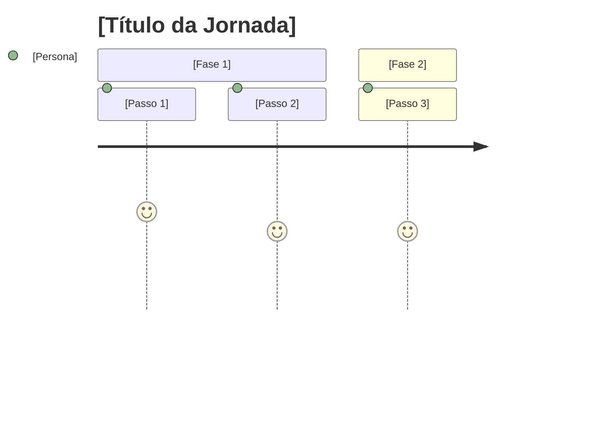

# Product Backlog — [Nome da Demanda]

## Metadata

| Field | Value |
|---|---|
| **Backlog ID** | PB-YYYY-NNN |
| **Version** | v1 |
| **Linked RP** | RP-YYYY-NNN vX |
| **Owned by** | [Nome] (PO) |
| **Status** | Draft |
| **Baselined date** | — |

> This document defines **what** will be built and **for whom**, from the user's perspective.
> It does not define how it will be built. Technical decisions belong to the Tech Backlog.

## Revision History

| Version | Date | Author | Summary |
|---|---|---|---|
| v1 | YYYY-MM-DD | [Nome] (PO) | Initial backlog. |

---

## Epic Map

| Epic | Description | Priority |
|---|---|---|
| EP-001 | [Nome do Épico] | Must Have / Should Have / Could Have |

---

## User Journey

### Overall Journey — [Persona Principal]

---

## EP-001 — [Nome do Épico]

**Goal:** [Objetivo do épico em uma frase]

---

### ST-001 — [Nome da História]

**As a** [persona],
**I want to** [ação],
**so that** [benefício].

**Acceptance Criteria:**
- [ ] [Critério 1]
- [ ] [Critério 2]

**Edge Cases:**
- [ ] [Edge case 1]
- [ ] [Edge case 2]

---

## Out of Scope (for this release)

| Item | Reason |
|---|---|
| [Item 1] | [Motivo] |
